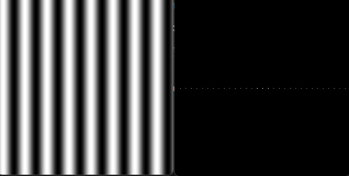
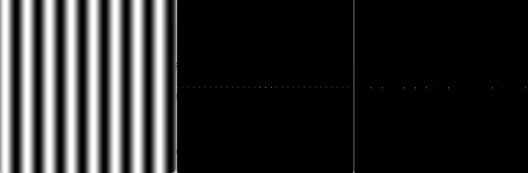
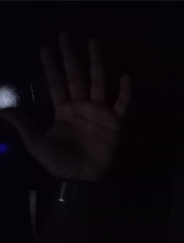
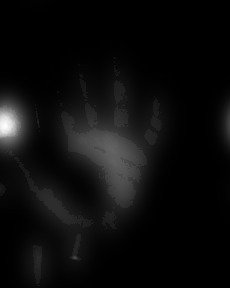
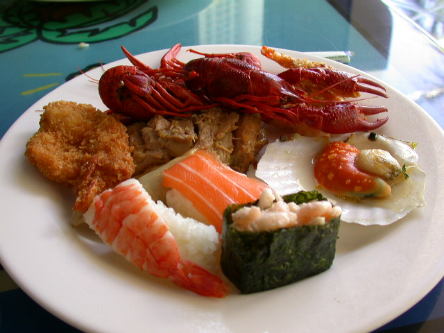
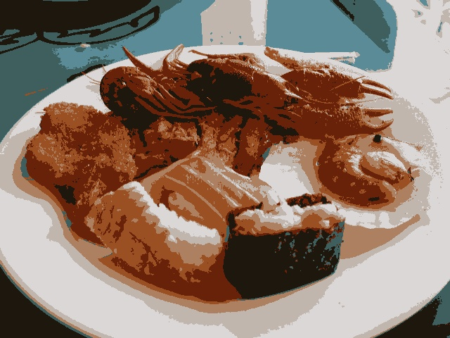
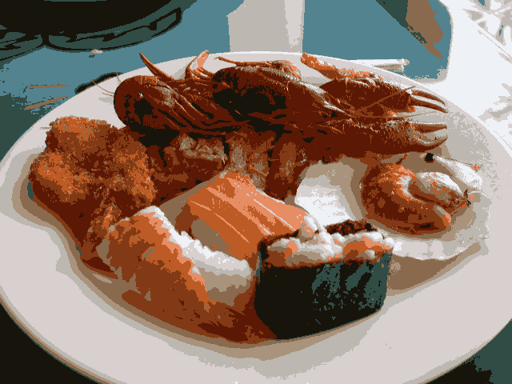
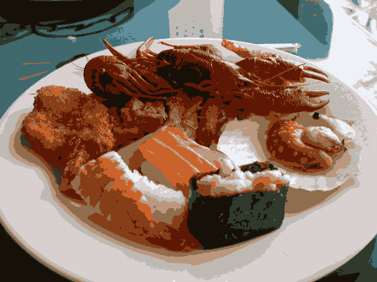
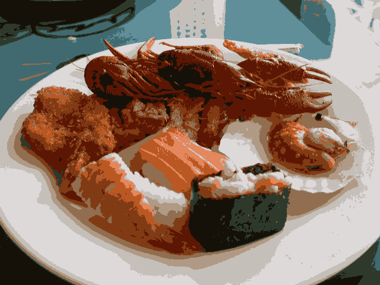

# Processamento-Digital-de-Imagens

# UNIDADE 2 - SEGUNDA LISTA DE EXERCÍCIOS

## 2.1 - Transformada Discreta de Fourier

- Exercício: Utilizando os programas dft.cpp, calcule e apresente o espectro de magnitude da imagem senoide-256.

A figura original, na esquerda, com espectro de magnitude, pode ser vista abaixo:

- Exercício: Usando agora o filestorage.cpp, mostrado na Listagem 15, “filestorage.cpp” como referência, adapte o programa exemplos/dft.cpp para ler a imagem em ponto flutuante armazenada no arquivo YAML equivalente (ilustrado na Listagem 18, “trecho do arquivo senoide-256.yml”).

Para isso, utilizamos o código abaixo:

~~~cpp
#include <iostream>
#include <vector>
#include <opencv2/opencv.hpp>
#include <sstream>
#include <string>

# define M_PI 3.14159265358979323846

int SIDE = 256;
int PERIODOS = 8;

void swapQuadrants(cv::Mat& image) {
  cv::Mat tmp, A, B, C, D;

  image = image(cv::Rect(0, 0, image.cols & -2, image.rows & -2));

  int centerX = image.cols / 2;
  int centerY = image.rows / 2;

  A = image(cv::Rect(0, 0, centerX, centerY));
  B = image(cv::Rect(centerX, 0, centerX, centerY));
  C = image(cv::Rect(0, centerY, centerX, centerY));
  D = image(cv::Rect(centerX, centerY, centerX, centerY));

  A.copyTo(tmp);
  D.copyTo(A);
  tmp.copyTo(D);

  C.copyTo(tmp);
  B.copyTo(C);
  tmp.copyTo(B);
}

int main(int argc, char** argv) {
  cv::Mat image, padded, complexImage;
  std::vector<cv::Mat> planos; 
  std::stringstream ss_img, ss_yml;

  ss_yml << "senoide-" << SIDE << ".yml";
  image = cv::Mat::zeros(SIDE, SIDE, CV_32FC1);

  cv::FileStorage fs(ss_yml.str(), cv::FileStorage::WRITE);

  for (int i = 0; i < SIDE; i++) {
    for (int j = 0; j < SIDE; j++) {
      image.at<float>(i, j) = 127 * sin(2 * M_PI * PERIODOS * j / SIDE) + 128;
    }
  }

  fs << "mat" << image;
  fs.release();

  cv::normalize(image, image, 0, 255, cv::NORM_MINMAX);
  image.convertTo(image, CV_8U);
  ss_img << "senoide-" << SIDE << ".png";
  cv::imwrite(ss_img.str(), image);

  fs.open(ss_yml.str(), cv::FileStorage::READ);
  fs["mat"] >> image;

  cv::normalize(image, image, 0, 255, cv::NORM_MINMAX);
  image.convertTo(image, CV_8U);
  
  if (image.empty()) {
    std::cout << "Erro abrindo imagem" << argv[1] << std::endl;
    return EXIT_FAILURE;
  }

  int dft_M = cv::getOptimalDFTSize(image.rows);
  int dft_N = cv::getOptimalDFTSize(image.cols); 
  cv::copyMakeBorder(image, padded, 0, dft_M - image.rows, 0, dft_N - image.cols, cv::BORDER_CONSTANT, cv::Scalar::all(0));

  planos.push_back(cv::Mat_<float>(padded)); 
  planos.push_back(cv::Mat::zeros(padded.size(), CV_32F));

  cv::merge(planos, complexImage);  

  cv::dft(complexImage, complexImage); 
  swapQuadrants(complexImage);

  cv::split(complexImage, planos);

  cv::Mat magn, fase;
  cv::cartToPolar(planos[0], planos[1], magn, fase, false);
  cv::normalize(fase, fase, 0, 1, cv::NORM_MINMAX);

  cv::magnitude(planos[0], planos[1], magn); 
  magn += cv::Scalar::all(1);

  log(magn, magn);
  cv::normalize(magn, magn, 0, 1, cv::NORM_MINMAX);

  cv::imshow("Imagem", image);  
  cv::imshow("Espectro de magnitude", magn);
  cv::imshow("Espectro de fase", fase);

  cv::waitKey();
  return EXIT_SUCCESS;
}
~~~

Como resultado, temos as imagens abaixo, a primeira imagem é a original, na segunda, possuímos o espectro de magnitude e na terceira imagem, o espectro de fase.

- Exercício: Compare o novo espectro de magnitude gerado com o valor teórico da transformada de Fourier da senóide. O que mudou para que o espectro de magnitude gerado agora esteja mais próximo do valor teórico? Porque isso aconteceu?

Resposta: O valor teórico fica mais próximo da senoide-25.yml, devido as casas decimais extras, com isso, é gerado uma imagem mais próxima do real.

## 2.2 - Filtragem no Domínio da Frequência

- Exercício: Utilizando o programa dftfilter.cpp como referência, implemente o filtro homomórfico para melhorar imagens com iluminação irregular. Crie uma cena mal iluminada e ajuste os parâmetros do filtro homomórfico para corrigir a iluminação da melhor forma possível. Assuma que a imagem fornecida é em tons de cinza.

~~~cpp
#include <iostream>
#include <opencv2/opencv.hpp>
#include <opencv2/imgproc/imgproc.hpp>

#define RADIUS 20

using namespace cv;
using namespace std;

void deslocaDFT(Mat& image ){
  Mat tmp, A, B, C, D;

  image = image(Rect(0, 0, image.cols & -2, image.rows & -2));
  int cx = image.cols/2;
  int cy = image.rows/2;

  A = image(Rect(0, 0, cx, cy));
  B = image(Rect(cx, 0, cx, cy));
  C = image(Rect(0, cy, cx, cy));
  D = image(Rect(cx, cy, cx, cy));

  A.copyTo(tmp);  D.copyTo(A);  tmp.copyTo(D);

  C.copyTo(tmp);  B.copyTo(C);  tmp.copyTo(B);
}

int main(int , char**){
  VideoCapture cap;
  Mat imaginaryInput, complexImage, multsp;
  Mat padded, filter, mag;
  Mat image, imagegray, tmp;
  Mat_<float> realInput, zeros;
  vector<Mat> planos;
  
  float Gh = 1.0, Gl = 1.0, d = 1.0, c = 1.0;
  double radius;

  char key;

  int dft_M, dft_N;

  cap.open(0);
  if(!cap.isOpened())
    return -1;

  cap >> image;

  dft_M = getOptimalDFTSize(image.rows);
  dft_N = getOptimalDFTSize(image.cols);

  copyMakeBorder(image, padded, 0,
                 dft_M - image.rows, 0,
                 dft_N - image.cols,
                 BORDER_CONSTANT, Scalar::all(0));

  zeros = Mat_<float>::zeros(padded.size());

  complexImage = Mat(padded.size(), CV_32FC2, Scalar(0));

  filter = complexImage.clone();

  tmp = Mat(dft_M, dft_N, CV_32F);

  for(int i=0; i<dft_M; i++)
  {
    for(int j=0; j<dft_N; j++)
    {
      radius = (double) (i - dft_M / 2) * (i - dft_M / 2) + (j - dft_N / 2) * (j - dft_N / 2);
      tmp.at<float> (i, j) = (Gh - Gl) * (1 - exp(-c * (radius / pow(d, 2)))) + Gl;
    }
  }

  Mat comps[]= {tmp, tmp};
  merge(comps, 2, filter);

  for(;;){
    cap >> image;
    cvtColor(image, imagegray, cv::COLOR_BGR2GRAY);
    imshow("original", imagegray);

    copyMakeBorder(imagegray, padded, 0,
                   dft_M - image.rows, 0,
                   dft_N - image.cols,
                   BORDER_CONSTANT, Scalar::all(0));

    planos.clear();

    realInput = Mat_<float>(padded);

    planos.push_back(realInput);
    planos.push_back(zeros);

    merge(planos, complexImage);

    dft(complexImage, complexImage);

    deslocaDFT(complexImage);

    mulSpectrums(complexImage,filter,complexImage,0);

    planos.clear();

    deslocaDFT(complexImage);

    cout << "Gl = " << Gl << " Gh = " << Gh << " D0 = " << d << " c = " << c << endl;
    idft(complexImage, complexImage);

    planos.clear();

    split(complexImage, planos);

    normalize(planos[0], planos[0], 0, 1, cv::NORM_MINMAX);
    imshow("filtrada", planos[0]);

    key = (char) waitKey(10);
    if( key == 27 ) break;
    switch(key){
    case 'a':
      Gl = Gl + 1;
      break;
    case 's':
      Gl = Gl - 1;
      break;
    case 'd':
      Gh = Gh + 1;
      break;
    case 'f':
      Gh = Gh - 1;
    case 'g':
      d = d + 1;
      break;
    case 'h':
      d = d - 1;
      break;
    case 'j':
      c = c + 1;
      break;
    case 'k':
      c = c - 1;
      break;
    }
  }
  return 0;
}
~~~

Abaixo, podemos ver na esquerda a imagem original e na direita, a imagem filtrada:

## 2.4 - Quantização vetorial com k-means

- Exercício: Utilizando o programa kmeans.cpp como exemplo prepare um programa exemplo onde a execução do código se dê usando o parâmetro nRodadas=1 e inciar os centros de forma aleatória usando o parâmetro KMEANS_RANDOM_CENTERS ao invés de KMEANS_PP_CENTERS. Realize 10 rodadas diferentes do algoritmo e compare as imagens produzidas. Explique porque elas podem diferir tanto.

~~~cpp
#include <cstdlib>
#include <opencv2/opencv.hpp>

int main(int argc, char** argv) {
  int nClusters = 8, nRodadas = 1;  // Modificado para nRodadas=1

  cv::Mat rotulos, centros;

  if (argc != 3) {
    std::cout << "kmeans entrada.jpg saida.jpg\n";
    exit(0);
  }

  cv::Mat img = cv::imread("C:/Users/rycha/Desktop/Projetos da Include/Processamento-Digital-de-Imagens/sushi.png", cv::IMREAD_COLOR);
  cv::Mat samples(img.rows * img.cols, 3, CV_32F);

  for (int y = 0; y < img.rows; y++) {
    for (int x = 0; x < img.cols; x++) {
      for (int z = 0; z < 3; z++) {
        samples.at<float>(y + x * img.rows, z) = img.at<cv::Vec3b>(y, x)[z];
      }
    }
  }

  cv::kmeans(samples, nClusters, rotulos,
             cv::TermCriteria(cv::TermCriteria::EPS | cv::TermCriteria::COUNT,
                              10000, 0.0001),
             nRodadas, cv::KMEANS_RANDOM_CENTERS, centros);

  cv::Mat rotulada(img.size(), img.type());
  for (int y = 0; y < img.rows; y++) {
    for (int x = 0; x < img.cols; x++) {
      int indice = rotulos.at<int>(y + x * img.rows, 0);
      rotulada.at<cv::Vec3b>(y, x)[0] = (uchar)centros.at<float>(indice, 0);
      rotulada.at<cv::Vec3b>(y, x)[1] = (uchar)centros.at<float>(indice, 1);
      rotulada.at<cv::Vec3b>(y, x)[2] = (uchar)centros.at<float>(indice, 2);
    }
  }

  cv::imshow("kmeans", rotulada);
  cv::waitKey(0);
  cv::imwrite("saida.jpg", rotulada);

  return 0;
}
~~~

- Imagem original

- Imagens modificadas

Em cada inicialização de centros, a imagem gerada sofre uma modificação. Para representar a imagem final, o algoritmo escolhe centros, que definem as cores que serão utilizadas. Com isso, os centros são gerados de maneira aleatória, possibilitando que o resultado final de cada centro seja diferente e consequentemente variando a imagem após cada iteração.

