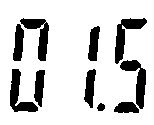
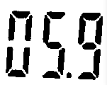
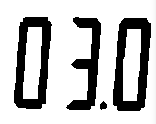
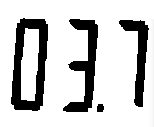

# Processamento-Digital-de-Imagens

# UNIDADE 2 - SEGUNDA LISTA DE EXERCÍCIOS

## 2.1 - Transformada Discreta de Fourier

- Exercício: Utilizando os programas dft.cpp, calcule e apresente o espectro de magnitude da imagem senoide-256.

A figura original, na esquerda, com espectro de magnitude, pode ser vista abaixo:

- Exercício: Usando agora o filestorage.cpp, mostrado na Listagem 15, “filestorage.cpp” como referência, adapte o programa exemplos/dft.cpp para ler a imagem em ponto flutuante armazenada no arquivo YAML equivalente (ilustrado na Listagem 18, “trecho do arquivo senoide-256.yml”).

Para isso, utilizamos o código abaixo:

~~~cpp
#include <iostream>
#include <vector>
#include <opencv2/opencv.hpp>
#include <sstream>
#include <string>

# define M_PI 3.14159265358979323846

int SIDE = 256;
int PERIODOS = 8;

void swapQuadrants(cv::Mat& image) {
  cv::Mat tmp, A, B, C, D;

  image = image(cv::Rect(0, 0, image.cols & -2, image.rows & -2));

  int centerX = image.cols / 2;
  int centerY = image.rows / 2;

  A = image(cv::Rect(0, 0, centerX, centerY));
  B = image(cv::Rect(centerX, 0, centerX, centerY));
  C = image(cv::Rect(0, centerY, centerX, centerY));
  D = image(cv::Rect(centerX, centerY, centerX, centerY));

  A.copyTo(tmp);
  D.copyTo(A);
  tmp.copyTo(D);

  C.copyTo(tmp);
  B.copyTo(C);
  tmp.copyTo(B);
}

int main(int argc, char** argv) {
  cv::Mat image, padded, complexImage;
  std::vector<cv::Mat> planos; 
  std::stringstream ss_img, ss_yml;

  ss_yml << "senoide-" << SIDE << ".yml";
  image = cv::Mat::zeros(SIDE, SIDE, CV_32FC1);

  cv::FileStorage fs(ss_yml.str(), cv::FileStorage::WRITE);

  for (int i = 0; i < SIDE; i++) {
    for (int j = 0; j < SIDE; j++) {
      image.at<float>(i, j) = 127 * sin(2 * M_PI * PERIODOS * j / SIDE) + 128;
    }
  }

  fs << "mat" << image;
  fs.release();

  cv::normalize(image, image, 0, 255, cv::NORM_MINMAX);
  image.convertTo(image, CV_8U);
  ss_img << "senoide-" << SIDE << ".png";
  cv::imwrite(ss_img.str(), image);

  fs.open(ss_yml.str(), cv::FileStorage::READ);
  fs["mat"] >> image;

  cv::normalize(image, image, 0, 255, cv::NORM_MINMAX);
  image.convertTo(image, CV_8U);
  
  if (image.empty()) {
    std::cout << "Erro abrindo imagem" << argv[1] << std::endl;
    return EXIT_FAILURE;
  }

  int dft_M = cv::getOptimalDFTSize(image.rows);
  int dft_N = cv::getOptimalDFTSize(image.cols); 
  cv::copyMakeBorder(image, padded, 0, dft_M - image.rows, 0, dft_N - image.cols, cv::BORDER_CONSTANT, cv::Scalar::all(0));

  planos.push_back(cv::Mat_<float>(padded)); 
  planos.push_back(cv::Mat::zeros(padded.size(), CV_32F));

  cv::merge(planos, complexImage);  

  cv::dft(complexImage, complexImage); 
  swapQuadrants(complexImage);

  cv::split(complexImage, planos);

  cv::Mat magn, fase;
  cv::cartToPolar(planos[0], planos[1], magn, fase, false);
  cv::normalize(fase, fase, 0, 1, cv::NORM_MINMAX);

  cv::magnitude(planos[0], planos[1], magn); 
  magn += cv::Scalar::all(1);

  log(magn, magn);
  cv::normalize(magn, magn, 0, 1, cv::NORM_MINMAX);

  cv::imshow("Imagem", image);  
  cv::imshow("Espectro de magnitude", magn);
  cv::imshow("Espectro de fase", fase);

  cv::waitKey();
  return EXIT_SUCCESS;
}
~~~

Como resultado, temos as imagens abaixo, a primeira imagem é a original, na segunda, possuímos o espectro de magnitude e na terceira imagem, o espectro de fase.

- Exercício: Compare o novo espectro de magnitude gerado com o valor teórico da transformada de Fourier da senóide. O que mudou para que o espectro de magnitude gerado agora esteja mais próximo do valor teórico? Porque isso aconteceu?

Resposta: O valor teórico fica mais próximo da senoide-25.yml, devido as casas decimais extras, com isso, é gerado uma imagem mais próxima do real.

## 2.2 - Filtragem no Domínio da Frequência

- Exercício: Utilizando o programa dftfilter.cpp como referência, implemente o filtro homomórfico para melhorar imagens com iluminação irregular. Crie uma cena mal iluminada e ajuste os parâmetros do filtro homomórfico para corrigir a iluminação da melhor forma possível. Assuma que a imagem fornecida é em tons de cinza.

~~~cpp
#include <iostream>
#include <opencv2/opencv.hpp>
#include <opencv2/imgproc/imgproc.hpp>

#define RADIUS 20

using namespace cv;
using namespace std;

void deslocaDFT(Mat& image ){
  Mat tmp, A, B, C, D;

  image = image(Rect(0, 0, image.cols & -2, image.rows & -2));
  int cx = image.cols/2;
  int cy = image.rows/2;

  A = image(Rect(0, 0, cx, cy));
  B = image(Rect(cx, 0, cx, cy));
  C = image(Rect(0, cy, cx, cy));
  D = image(Rect(cx, cy, cx, cy));

  A.copyTo(tmp);  D.copyTo(A);  tmp.copyTo(D);

  C.copyTo(tmp);  B.copyTo(C);  tmp.copyTo(B);
}

int main(int , char**){
  VideoCapture cap;
  Mat imaginaryInput, complexImage, multsp;
  Mat padded, filter, mag;
  Mat image, imagegray, tmp;
  Mat_<float> realInput, zeros;
  vector<Mat> planos;
  
  float Gh = 1.0, Gl = 1.0, d = 1.0, c = 1.0;
  double radius;

  char key;

  int dft_M, dft_N;

  cap.open(0);
  if(!cap.isOpened())
    return -1;

  cap >> image;

  dft_M = getOptimalDFTSize(image.rows);
  dft_N = getOptimalDFTSize(image.cols);

  copyMakeBorder(image, padded, 0,
                 dft_M - image.rows, 0,
                 dft_N - image.cols,
                 BORDER_CONSTANT, Scalar::all(0));

  zeros = Mat_<float>::zeros(padded.size());

  complexImage = Mat(padded.size(), CV_32FC2, Scalar(0));

  filter = complexImage.clone();

  tmp = Mat(dft_M, dft_N, CV_32F);

  for(int i=0; i<dft_M; i++)
  {
    for(int j=0; j<dft_N; j++)
    {
      radius = (double) (i - dft_M / 2) * (i - dft_M / 2) + (j - dft_N / 2) * (j - dft_N / 2);
      tmp.at<float> (i, j) = (Gh - Gl) * (1 - exp(-c * (radius / pow(d, 2)))) + Gl;
    }
  }

  Mat comps[]= {tmp, tmp};
  merge(comps, 2, filter);

  for(;;){
    cap >> image;
    cvtColor(image, imagegray, cv::COLOR_BGR2GRAY);
    imshow("original", imagegray);

    copyMakeBorder(imagegray, padded, 0,
                   dft_M - image.rows, 0,
                   dft_N - image.cols,
                   BORDER_CONSTANT, Scalar::all(0));

    planos.clear();

    realInput = Mat_<float>(padded);

    planos.push_back(realInput);
    planos.push_back(zeros);

    merge(planos, complexImage);

    dft(complexImage, complexImage);

    deslocaDFT(complexImage);

    mulSpectrums(complexImage,filter,complexImage,0);

    planos.clear();

    deslocaDFT(complexImage);

    cout << "Gl = " << Gl << " Gh = " << Gh << " D0 = " << d << " c = " << c << endl;
    idft(complexImage, complexImage);

    planos.clear();

    split(complexImage, planos);

    normalize(planos[0], planos[0], 0, 1, cv::NORM_MINMAX);
    imshow("filtrada", planos[0]);

    key = (char) waitKey(10);
    if( key == 27 ) break;
    switch(key){
    case 'a':
      Gl = Gl + 1;
      break;
    case 's':
      Gl = Gl - 1;
      break;
    case 'd':
      Gh = Gh + 1;
      break;
    case 'f':
      Gh = Gh - 1;
    case 'g':
      d = d + 1;
      break;
    case 'h':
      d = d - 1;
      break;
    case 'j':
      c = c + 1;
      break;
    case 'k':
      c = c - 1;
      break;
    }
  }
  return 0;
}
~~~

Abaixo, podemos ver na esquerda a imagem original e na direita, a imagem filtrada:

## 2.4 - Quantização vetorial com k-means

- Exercício: Utilizando o programa kmeans.cpp como exemplo prepare um programa exemplo onde a execução do código se dê usando o parâmetro nRodadas=1 e inciar os centros de forma aleatória usando o parâmetro KMEANS_RANDOM_CENTERS ao invés de KMEANS_PP_CENTERS. Realize 10 rodadas diferentes do algoritmo e compare as imagens produzidas. Explique porque elas podem diferir tanto.

~~~cpp
#include <cstdlib>
#include <opencv2/opencv.hpp>

int main(int argc, char** argv) {
  int nClusters = 8, nRodadas = 1;  // Modificado para nRodadas=1

  cv::Mat rotulos, centros;

  if (argc != 3) {
    std::cout << "kmeans entrada.jpg saida.jpg\n";
    exit(0);
  }

  cv::Mat img = cv::imread("C:/Users/rycha/Desktop/Projetos da Include/Processamento-Digital-de-Imagens/sushi.png", cv::IMREAD_COLOR);
  cv::Mat samples(img.rows * img.cols, 3, CV_32F);

  for (int y = 0; y < img.rows; y++) {
    for (int x = 0; x < img.cols; x++) {
      for (int z = 0; z < 3; z++) {
        samples.at<float>(y + x * img.rows, z) = img.at<cv::Vec3b>(y, x)[z];
      }
    }
  }

  cv::kmeans(samples, nClusters, rotulos,
             cv::TermCriteria(cv::TermCriteria::EPS | cv::TermCriteria::COUNT,
                              10000, 0.0001),
             nRodadas, cv::KMEANS_RANDOM_CENTERS, centros);

  cv::Mat rotulada(img.size(), img.type());
  for (int y = 0; y < img.rows; y++) {
    for (int x = 0; x < img.cols; x++) {
      int indice = rotulos.at<int>(y + x * img.rows, 0);
      rotulada.at<cv::Vec3b>(y, x)[0] = (uchar)centros.at<float>(indice, 0);
      rotulada.at<cv::Vec3b>(y, x)[1] = (uchar)centros.at<float>(indice, 1);
      rotulada.at<cv::Vec3b>(y, x)[2] = (uchar)centros.at<float>(indice, 2);
    }
  }

  cv::imshow("kmeans", rotulada);
  cv::waitKey(0);
  cv::imwrite("saida.jpg", rotulada);

  return 0;
}
~~~

- Imagem original

- Imagens modificadas

Em cada inicialização de centros, a imagem gerada sofre uma modificação. Para representar a imagem final, o algoritmo escolhe centros, que definem as cores que serão utilizadas. Com isso, os centros são gerados de maneira aleatória, possibilitando que o resultado final de cada centro seja diferente e consequentemente variando a imagem após cada iteração.

# UNIDADE 3

## 3.1 - Contornos

- Exercício: Utilizando o programa contornos.cpp como referência, aplique-o na extração do contorno da imagem retangulos.png mostrada na Figura 55, “Retângulos superpostos”. Quantos pontos são gerados para o contorno dos retângulos?

*Resposta: são gerados 745 pontos*

- Exercício: Modifique o programa para extrair os contornos internos das componentes conectadas presentes na imagem formas.png. Para isso, altere o parâmetro cv::CHAIN_APPROX_NONE para cv::CHAIN_APPROX_SIMPLE na função findContours(). O que acontece com os novos contornos extraídos? Mostre quantos pontos são gerados após a alteração e discuta como a modificação do parâmetro cv::CHAIN_APPROX_SIMPLE influencia na extração do contorno.

Aplicando o código abaixo:

~~~cpp
#include <fstream>
#include <iostream>
#include <opencv2/opencv.hpp>

int main(int argc, char **argv){
  cv::Mat image;
  std::ofstream file;

  image = cv::imread(argv[1], cv::IMREAD_GRAYSCALE);

  if (!image.data){
    std::cout << "Não foi possível abrir" << argv[1] << std::endl;
    return 0;
  }

  //aplicando threshold
  cv::threshold(image, image, 1, 255, cv::THRESH_BINARY + cv::THRESH_OTSU);

  std::vector<std::vector<cv::Point>> contornos;
  std::vector<cv::Vec4i> hierarchy;

  // abaixo temos 2 tipos de aproximação, onde uma gera um CSV extenso (NONE) e outra gera um CSV reduzido

  cv::findContours(image, contornos, hierarchy, cv::RETR_EXTERNAL, cv::CHAIN_APPROX_NONE);
  //cv::findContours(image, contornos, hierarchy, cv::RETR_EXTERNAL, cv::CHAIN_APPROX_SIMPLE);

  cv::cvtColor(image, image, cv::COLOR_GRAY2BGR);

  file.open("contornos.svg");
  if (!file.is_open()){
    std::cout << "Não foi possível abrir contornos.svg" << std::endl;
    return 0;
  }

  file << "<svg height=\"" << image.rows << "\" width=\"" << image.cols
       << "\" xmlns=\"http://www.w3.org/2000/svg\">" << std::endl;

  //para realizar contagem de pontos
  int count = 0;

  for (size_t i = 0; i < contornos.size(); i++){
    file << "<path d=\"M " << contornos[i][0].x << " " << contornos[i][0].y << " ";
    for (size_t j = 1; j < contornos[i].size(); j++){
      file << "L" << contornos[i][j].x << " " << contornos[i][j].y << " ";
      count++;
    }
    file << "Z\" fill=\"#cccccc\" stroke=\"red\" stroke-width=\"1\" />" << std::endl;
    cv::drawContours(image, contornos, static_cast<int>(i), cv::Scalar(255, 0, 0));
  }

  std::cout << "Total de pontos de contornos: " << count << std::endl;

  file << "</svg>" << std::endl;
  file.close();

  cv::imshow("Imagem", image);
  cv::waitKey();

  return 0;
}
~~~

Quando utilizamos cv::CHAIN_APPROX_NONE, não ocorrerá nenhuma compressão, ou seja, serão armazenados todos os pontos do contorno, incluindo pontos de fronteira, porém, quando utilizamos cv::CHAIN_APPROX_SIMPLE, essa compressão já ocorre, podendo ter pontos horizontais e verticais comprimidos, armazenando apenas os pontos finais dos segmentos.

Ao executarmos os arquivos, geramos um arquivo .csv, como podemos reparar nos 2 exemplos abaixo, o primeiro sem compressão(NONE) e o segundo com compressão(SIMPLE):

cv::CHAIN_APPROX_NONE:
~~~cpp
<svg height="256" width="256" xmlns="http://www.w3.org/2000/svg">
<path d="M 31 35 L31 36 L31 37 L31 38 L31 39 L31 40 L31 41 L31 42 L31 43 L31 44 L31 45 L31 46 L31 47 L31 48 L31 49 L31 50 L31 51 L31 52 L31 53 L31 54 L31 55 L31 56 L31 57 L31 58 L31 59 L31 60 L31 61 L31 62 L31 63 L31 64 L31 65 L31 66 L31 67 L31 68 L31 69 L31 70 L31 71 L31 72 L31 73 L31 74 L31 75 L31 76 L31 77 L31 78 L31 79 L31 80 L31 81 L31 82 L31 83 L31 84 L31 85 L31 86 L31 87 L31 88 L31 89 L31 90 L31 91 L31 92 L31 93 L31 94 L31 95 L31 96 L31 97 L31 98 L31 99 L31 100 L31 101 L31 102 L31 103 L31 104 L31 105 L31 106 L31 107 L31 108 L31 109 L31 110 L31 111 L31 112 L31 113 L31 114 L31 115 L31 116 L31 117 L31 118 L31 119 L31 120 L31 121 L31 122 L31 123 L31 124 L31 125 L31 126 L31 127 L31 128 L31 129 L31 130 L31 131 L31 132 L31 133 L31 134 L31 135 L31 136 L31 137 L31 138 L31 139 L31 140 L31 141 L31 142 L31 143 L31 144 L31 145 L31 146 L31 147 L31 148 L31 149 L31 150 L31 151 L31 152 L31 153 L31 154 L31 155 L32 155 L33 155 L34 155 L35 155 L36 155 L37 155 L38 155 L39 155 L40 155 L41 155 L42 155 L43 155 L44 155 L45 155 L46 155 L47 155 L48 155 L49 155 L50 155 L51 155 L52 155 L53 155 L54 155 L55 155 L56 155 L57 155 L58 155 L59 155 L60 155 L61 155 L62 155 L63 155 L64 155 L65 155 L66 155 L67 155 L68 155 L69 155 L70 155 L71 155 L72 155 L73 155 L74 155 L75 155 L76 155 L77 155 L78 155 L79 155 L80 155 L81 155 L82 155 L83 156 L83 157 L83 158 L83 159 L83 160 L83 161 L83 162 L83 163 L83 164 L83 165 L83 166 L83 167 L83 168 L83 169 L83 170 L83 171 L83 172 L83 173 L83 174 L83 175 L83 176 L83 177 L83 178 L83 179 L83 180 L83 181 L83 182 L83 183 L83 184 L83 185 L83 186 L83 187 L83 188 L83 189 L83 190 L83 191 L83 192 L83 193 L83 194 L83 195 L83 196 L83 197 L83 198 L83 199 L83 200 L83 201 L83 202 L83 203 L83 204 L83 205 L83 206 L83 207 L83 208 L83 209 L83 210 L83 211 L83 212 L83 213 L83 214 L83 215 L83 216 L83 217 L83 218 L83 219 L83 220 L83 221 L83 222 L83 223 L83 224 L83 225 L84 225 L85 225 L86 225 L87 225 L88 225 L89 225 L90 225 L91 225 L92 225 L93 225 L94 225 L95 225 L96 225 L97 225 L98 225 L99 225 L100 225 L101 225 L102 225 L103 225 L104 225 L105 225 L106 225 L107 225 L108 225 L109 225 L110 225 L111 225 L112 225 L113 225 L114 225 L115 225 L116 225 L117 225 L118 225 L119 225 L120 225 L121 225 L122 225 L123 225 L124 225 L125 225 L126 225 L127 225 L128 225 L129 225 L130 225 L131 225 L132 225 L133 225 L134 225 L135 225 L136 225 L137 225 L138 225 L139 225 L140 225 L141 225 L142 225 L143 225 L144 225 L145 225 L146 225 L147 225 L148 225 L149 225 L150 225 L151 225 L152 225 L153 225 L154 225 L155 225 L156 225 L157 225 L158 225 L159 225 L160 225 L161 225 L162 225 L163 225 L164 225 L165 225 L166 225 L167 225 L168 225 L169 225 L170 225 L171 225 L172 225 L173 225 L174 225 L175 225 L176 225 L177 225 L178 225 L179 225 L180 225 L181 225 L182 225 L183 225 L184 225 L185 225 L186 225 L187 225 L188 225 L189 225 L190 225 L191 225 L192 225 L193 225 L194 225 L195 225 L196 225 L197 225 L198 225 L199 225 L200 225 L201 225 L202 225 L203 225 L204 225 L205 225 L206 225 L207 225 L208 225 L209 225 L210 225 L211 225 L212 225 L213 225 L214 225 L215 225 L215 224 L215 223 L215 222 L215 221 L215 220 L215 219 L215 218 L215 217 L215 216 L215 215 L215 214 L215 213 L215 212 L215 211 L215 210 L215 209 L215 208 L215 207 L215 206 L215 205 L215 204 L215 203 L215 202 L215 201 L215 200 L215 199 L215 198 L215 197 L215 196 L215 195 L215 194 L215 193 L215 192 L215 191 L215 190 L215 189 L215 188 L215 187 L215 186 L215 185 L215 184 L215 183 L215 182 L215 181 L215 180 L215 179 L215 178 L215 177 L215 176 L215 175 L215 174 L215 173 L215 172 L215 171 L215 170 L215 169 L215 168 L215 167 L215 166 L215 165 L215 164 L215 163 L215 162 L215 161 L215 160 L215 159 L215 158 L215 157 L215 156 L215 155 L215 154 L215 153 L215 152 L215 151 L215 150 L215 149 L215 148 L215 147 L215 146 L215 145 L215 144 L215 143 L215 142 L215 141 L215 140 L215 139 L215 138 L215 137 L215 136 L215 135 L215 134 L215 133 L215 132 L215 131 L215 130 L215 129 L215 128 L215 127 L215 126 L215 125 L215 124 L215 123 L215 122 L215 121 L215 120 L215 119 L215 118 L215 117 L215 116 L215 115 L215 114 L215 113 L215 112 L215 111 L215 110 L215 109 L215 108 L215 107 L215 106 L215 105 L215 104 L215 103 L215 102 L215 101 L215 100 L215 99 L215 98 L215 97 L215 96 L215 95 L215 94 L215 93 L214 93 L213 93 L212 93 L211 93 L210 93 L209 93 L208 93 L207 93 L206 93 L205 93 L204 93 L203 93 L202 93 L201 93 L200 93 L199 93 L198 93 L197 93 L196 93 L195 93 L194 93 L193 93 L192 93 L191 93 L190 93 L189 93 L188 93 L187 93 L186 93 L185 93 L184 93 L183 93 L182 93 L181 93 L180 93 L179 93 L178 93 L177 93 L176 93 L175 93 L174 93 L173 93 L172 93 L171 93 L170 93 L169 93 L168 93 L167 93 L166 93 L165 93 L164 93 L163 93 L162 93 L161 93 L160 93 L159 93 L158 93 L157 93 L156 93 L155 93 L154 93 L153 93 L152 92 L152 91 L152 90 L152 89 L152 88 L152 87 L152 86 L152 85 L152 84 L152 83 L152 82 L152 81 L152 80 L152 79 L152 78 L152 77 L152 76 L152 75 L152 74 L152 73 L152 72 L152 71 L152 70 L152 69 L152 68 L152 67 L152 66 L152 65 L152 64 L152 63 L152 62 L152 61 L152 60 L152 59 L152 58 L152 57 L152 56 L152 55 L152 54 L152 53 L152 52 L152 51 L152 50 L152 49 L152 48 L152 47 L152 46 L152 45 L152 44 L152 43 L152 42 L152 41 L152 40 L152 39 L152 38 L152 37 L152 36 L152 35 L151 35 L150 35 L149 35 L148 35 L147 35 L146 35 L145 35 L144 35 L143 35 L142 35 L141 35 L140 35 L139 35 L138 35 L137 35 L136 35 L135 35 L134 35 L133 35 L132 35 L131 35 L130 35 L129 35 L128 35 L127 35 L126 35 L125 35 L124 35 L123 35 L122 35 L121 35 L120 35 L119 35 L118 35 L117 35 L116 35 L115 35 L114 35 L113 35 L112 35 L111 35 L110 35 L109 35 L108 35 L107 35 L106 35 L105 35 L104 35 L103 35 L102 35 L101 35 L100 35 L99 35 L98 35 L97 35 L96 35 L95 35 L94 35 L93 35 L92 35 L91 35 L90 35 L89 35 L88 35 L87 35 L86 35 L85 35 L84 35 L83 35 L82 35 L81 35 L80 35 L79 35 L78 35 L77 35 L76 35 L75 35 L74 35 L73 35 L72 35 L71 35 L70 35 L69 35 L68 35 L67 35 L66 35 L65 35 L64 35 L63 35 L62 35 L61 35 L60 35 L59 35 L58 35 L57 35 L56 35 L55 35 L54 35 L53 35 L52 35 L51 35 L50 35 L49 35 L48 35 L47 35 L46 35 L45 35 L44 35 L43 35 L42 35 L41 35 L40 35 L39 35 L38 35 L37 35 L36 35 L35 35 L34 35 L33 35 L32 35 Z" fill="#cccccc" stroke="red" stroke-width="1" />
</svg>
~~~

cv::CHAIN_APPROX_SIMPLE
~~~cpp
<svg height="256" width="256" xmlns="http://www.w3.org/2000/svg">
<path d="M 31 35 L31 155 L82 155 L83 156 L83 225 L215 225 L215 93 L153 93 L152 92 L152 35 Z" fill="#cccccc" stroke="red" stroke-width="1" />
</svg>
~~~

Abaixo podemos ver o resultado do antes e depois, onde não se foi notado alterações, além de que só foram encontrados *9 contornos* após usar *cv::CHAIN_APPROX_SIMPLE*

Antes: 

Depois:

## 3.2 - Extração de características: Momentos de Hu para regiões

- Exercício: Utilizando o programa momentos-regioes.cpp como referência utilize as imagens pessoa.jpg e multidao.jpg e descubra em que posição a pessoa da primeira imagem se encontra na segunda imagem. Caso o programa fique lento, verifique se é possível utilizar a função cv::resize() para redimensionar as imagens e tornar o processamento mais rápido. Discuta as dificuldades encontradas na resolução do problema.

As imagens utilizadas foram as seguintes:

Foi-se utilizado o código abaixo para realizar a atividade:

~~~cpp
#include <iostream>
#include <vector>
#include <cmath>
#include <opencv2/opencv.hpp>

int main(int argc, char* argv[]) {
    if (argc < 3) {
        std::cerr << "Usage: " << argv[0] << " <base_image> <target_image1> <target_image2> ..." << std::endl;
        return -1;
    }

    // Carrega a imagem base
    cv::Mat baseImageGray = cv::imread(argv[1], cv::IMREAD_GRAYSCALE);
    cv::Mat baseImageColor = cv::imread(argv[1], cv::IMREAD_COLOR);

    if (baseImageGray.empty() || baseImageColor.empty()) {
        std::cerr << "Could not open or find the base image!" << std::endl;
        return -1;
    }

    // Fator de escala para redimensionamento
    double scaleFactor = 0.5;

    // Loop através de cada imagem alvo
    for (int i = 2; i < argc; ++i) {
        // Carrega a imagem alvo
        cv::Mat targetImageGray = cv::imread(argv[i], cv::IMREAD_GRAYSCALE);
        if (targetImageGray.empty()) {
            std::cerr << "Could not open or find target image " << argv[i] << "!" << std::endl;
            continue;
        }

        // Calcula os momentos Hu para a imagem alvo
        double targetHuMoments[7];
        cv::Moments targetMoments = cv::moments(targetImageGray, false);
        cv::HuMoments(targetMoments, targetHuMoments);

        for (double& moment : targetHuMoments) {
            moment = -1 * std::copysign(1.0, moment) * std::log10(std::abs(moment));
        }

        // Abordagem de janela deslizante para encontrar a imagem alvo na imagem base
        int windowHeight = targetImageGray.rows;
        int windowWidth = targetImageGray.cols;
        double minDiff = std::numeric_limits<double>::max();
        cv::Point bestMatch;

        std::cout << "🔍 Searching for target " << i - 1 << " in the base image" << std::endl;
        for (int y = 0; y <= baseImageGray.rows - windowHeight; ++y) {
            for (int x = 0; x <= baseImageGray.cols - windowWidth; ++x) {
                cv::Rect window(x, y, windowWidth, windowHeight);
                cv::Mat subImage = baseImageGray(window);

                // Calcula os momentos Hu para a janela atual
                double subImageHuMoments[7];
                cv::Moments subImageMoments = cv::moments(subImage, false);
                cv::HuMoments(subImageMoments, subImageHuMoments);

                for (double& moment : subImageHuMoments) {
                    moment = -1 * std::copysign(1.0, moment) * std::log10(std::abs(moment));
                }

                // Calcula a diferença entre os momentos
                double diff = 0.0;
                for (int j = 0; j < 7; ++j) {
                    diff += std::abs(targetHuMoments[j] - subImageHuMoments[j]);
                }

                // Atualiza a melhor correspondência se a diferença atual for menor
                if (diff < minDiff) {
                    minDiff = diff;
                    bestMatch = cv::Point(x, y);
                }
            }
        }

        // Desenha um retângulo na imagem base
        cv::rectangle(baseImageColor, bestMatch, cv::Point(bestMatch.x + windowWidth, bestMatch.y + windowHeight), cv::Scalar(0, 0, 255), 4);

        std::cout << "Target " << i - 1 << " best match found at: " << bestMatch << std::endl;
        std::cout << "Difference: " << minDiff << std::endl;
        std::cout << "Target " << i - 1 << " Hu Moments: ";
        for (const double& moment : targetHuMoments) {
            std::cout << moment << " ";
        }
        std::cout << std::endl;

        // Exibe a imagem base com o retângulo
        cv::imshow("Base Image with Rectangle", baseImageColor);
        cv::waitKey(0);
    }

    return 0;
}

~~~

## 3.4 - Filtragem de forma com Morfologia matemática

- Exercício: Um sistema de captura de imagens precisa realizar o reconhecimento de carateres de um visor de segmentos para uma aplicação industrial. Ocorre que o software de reconhecimento de padrões apresenta dificuldades de reconhecer os dígitos em virtude da separação existente entre os segmentos do visor. Usando o programa morfologia.cpp como referência, crie um programa que resolva o problema da pré-filtragem de forma para reconhecimento dos caracteres usando operações morfológicas. Você poderá usar as imagens digitos-1.png, digitos-2.png, digitos-3.png, digitos-4.png e digitos-5.png para testar seu programa. Cuidado para deixar o ponto decimal separado dos demais dígitos para evitar um reconhecimento errado do número no visor.

As imagens iniciais utilizadas são as seguintes:

~~~cpp
#include <iostream>
#include <opencv2/opencv.hpp>

int main(int argc, char** argv) {
  cv::Mat digitos1, dilatacao1, erosao1;
  cv::Mat digitos2, dilatacao2, erosao2;
  cv::Mat digitos3, dilatacao3, erosao3;
  cv::Mat digitos4, dilatacao4, erosao4;
  cv::Mat digitos5, dilatacao5, erosao5;
  cv::Mat str, image;

  digitos1 = cv::imread("../digitos-1.png", cv::IMREAD_UNCHANGED);
  digitos2 = cv::imread("../digitos-2.png", cv::IMREAD_UNCHANGED);
  digitos3 = cv::imread("../digitos-3.png", cv::IMREAD_UNCHANGED);
  digitos4 = cv::imread("../digitos-4.png", cv::IMREAD_UNCHANGED);
  digitos5 = cv::imread("../digitos-5.png", cv::IMREAD_UNCHANGED);

    if(digitos1.empty()){
        std::cout << "Não foi possível carregar a imagem digito 1" << std::endl;
        return -1;
    }

    if(digitos2.empty()){
        std::cout << "Não foi possível carregar a imagem digito 2" << std::endl;
        return -1;
    }

    if(digitos3.empty()){
        std::cout << "Não foi possível carregar a imagem digito 3" << std::endl;
        return -1;
    }

    if(digitos4.empty()){
        std::cout << "Não foi possível carregar a imagem digito 4" << std::endl;
        return -1;
    }

  cv::bitwise_not(digitos1, digitos1);
  cv::bitwise_not(digitos2, digitos2);
  cv::bitwise_not(digitos3, digitos3);
  cv::bitwise_not(digitos4, digitos4);
  cv::bitwise_not(digitos5, digitos5);

  str = cv::getStructuringElement(cv::MORPH_RECT, cv::Size(3, 15));

  cv::dilate(digitos1, dilatacao1, str);
  cv::erode(dilatacao1, erosao1, str);

  cv::dilate(digitos2, dilatacao2, str);
  cv::erode(dilatacao2, erosao2, str);

  cv::dilate(digitos3, dilatacao3, str);
  cv::erode(dilatacao3, erosao3, str);

  cv::dilate(digitos4, dilatacao4, str);
  cv::erode(dilatacao4, erosao4, str);

  cv::dilate(digitos5, dilatacao5, str);
  cv::erode(dilatacao5, erosao5, str);

  cv::bitwise_not(erosao1, erosao1);
  cv::bitwise_not(erosao2, erosao2);
  cv::bitwise_not(erosao3, erosao3);
  cv::bitwise_not(erosao4, erosao4);
  cv::bitwise_not(erosao5, erosao5);

  cv::imwrite("morfologia-digito-1.png", erosao1);
  cv::imwrite("morfologia-digito-2.png", erosao2);
  cv::imwrite("morfologia-digito-3.png", erosao3);
  cv::imwrite("morfologia-digito-4.png", erosao4);
  cv::imwrite("morfologia-digito-5.png", erosao5);

  cv::waitKey();
  return 0;
}
~~~

Após a aplicação do código, podemos visualizar a saída das imagens abaixo:

